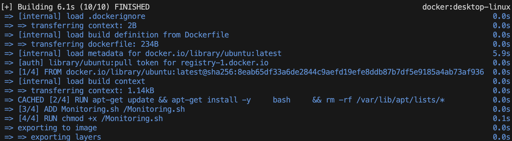
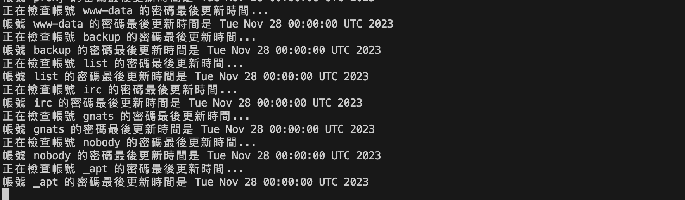
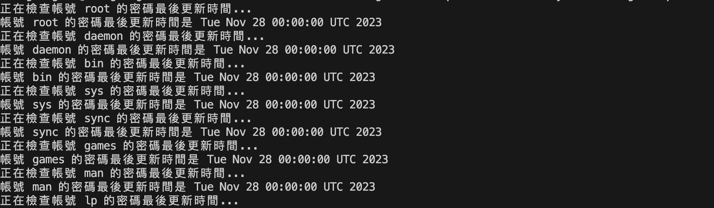

# Automatic-scheduling-Shellscript

> 1. Monitoring.sh：提醒用戶要記得換密碼 <br>
> 2. 用於Linux system
> 3. 能夠偵測/etc/shadow

## 流程


## 架構


## 如何運行
> Bulid my dockerfile
```
docker build -t my-monitoring-script .
```

> run my images
```
docker run my-monitoring-script
```

## 過程


## demo



